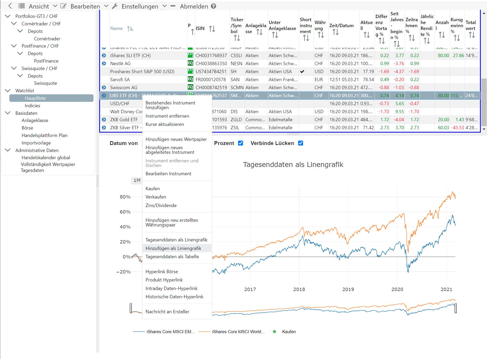

# Grafioschtrader (GT)
+ **Multi-tenancy**: GT can be run for a group of investors or in single mode.
+ **Web application**: GT is a web application and provides the clearest results using a desktop web browser.

+ **Multiple portfolios with currency accounts**: Replicates multiple portfolios with one or more securities accounts and one or more bank cash accounts.
+ **Multiple currencies**: Trading securities in different currencies
+ **Trading from the turn of the millennium**: Basic support for historical price data from the year 2000 onwards, noting that obtaining price data from non-traded securities may be a problem.
+ **Different financial instruments**: Stocks, Bonds, ETF, securities without price data, short ETF, CFD, Forex.
+ **Import of transactions**: An import of single or multiple PDFs with securities transactions Via CSV file, account transactions can also be loaded.
+ **Evaluations by asset classes**: Evaluations by common asset classes such as stocks, bonds, real estate, commodities, etc.
## Take al look
* The [manual](//hugograf.github.io/grafioschtrader/de/intro/) in German which is in progress.
* [GT in action](//www.grafioschtrader.info/grafioschtrader) with a following demo account or create your own account.

| E-Mail  | Passwort |
| ------------- | ------------- |
| gt1@grafioschtrader.info  | gt1  |
| gt2@grafioschtrader.info  | gt2  |
| gt3@grafioschtrader.info  | gt3  |
| gt4@grafioschtrader.info  | gt4  |



For questions or suggestions please visit the [forum](//www.grafioschtrader.info/forums/), German and English language are welcome.
## Contributing ##
If you want to contribute to a project and make it better, your help is very welcome. Take a look at [projects](//github.com/hugograf/grafioschtrader/projects/1). 

## Development Environment
### Prerequisite
* [Java JDK 11](https://jdk.java.net/java-se-ri/11): The Java development Kit for the backend
* [Apache Maven](https://maven.apache.org/): The build system for the backend
* [Node.js with npm](https://nodejs.org/en/): The build system for frontend
* [MariaDB](https://mariadb.org/) 10.3.1+: All data are saved in an instance of MariaDB Server. Before installation check the version of MariaDB with "**mysql -u root -p**".
* [HUGO](https://gohugo.io/): It a static site generator. It is used for help pages. The Web user interface has links to this weg pages.
### Email account
GT requires access to an Email account for user registration. The settings for Google's Gmail would be similar to the following. Note that for Gmail maybe the security settings must changed. Gmail must be enabled for less secure apps.
```
spring.mail.host=smtp.gmail.com
spring.mail.port=587
spring.mail.username=grafiosch@gmail.com
spring.mail.password=DEC(YOUR_MAIL_PASSWORD)
spring.mail.properties.mail.smtp.auth=true
spring.mail.properties.mail.smtp.starttls.enable=true
```
### Database preparation
For the database only a empty database with user access is required. Everthing else is done with the first start of GT. In the following statement change at least **"YOUR_DB_PASSWORD"** with your own password.
```
mysql -u root -p -e "create database grafioschtrader; GRANT ALL PRIVILEGES ON grafioschtrader.* TO grafioschtrader@localhost IDENTIFIED BY 'YOUR_DB_PASSWORD'"
```
## Build deployment artifacts
It depends on the target system how the deployment is happened.
1. Install the required Software
2. [Build and run the backend](backend/README.md)
3. [Build and run the frontend](frontend/README.md)
4. [Optional build and run the manual](manual/README.md)
5. [Optional build the transform application](transform/README.md)

For further information on deployment, consult the [wiki](//github.com/hugograf/grafioschtrader/wiki).
