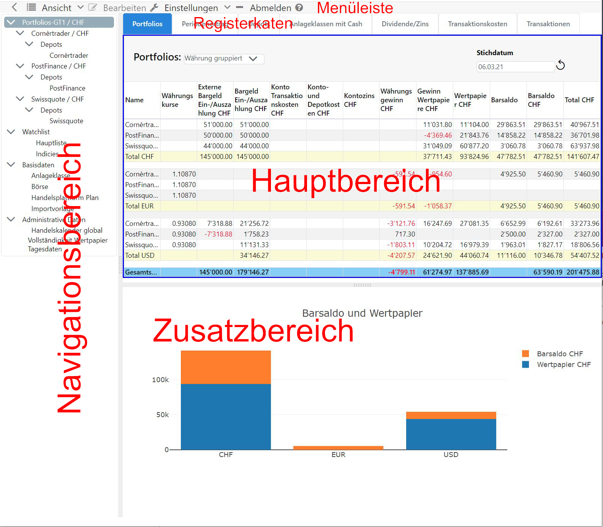

## Benutzeroberfläche
Die Anwendung findet in einem Webbrowser statt, daher ist GT eine **Client-Serve-Anwendung**. Üblichweise wird hierbei von einer **Client-Server-Anwendung** gesprochen, die ein **Front-End** und einen **Server** als **Back-End** beinhalten. Der **Client** ist eine **Einzelseiten-Webanwendung** die nach dem **Login** aus einem einzigen HTML-Dokument besteht. Es werden dynamisch einzelne Seitenbereiche aufgefrischt oder ausgetauscht. Der **Server** wird nach dem Aufruft der ersten Seiten von GT zu einem reinen Datenlieferanten für den Client. Die Benutzergerechte Aufbereitung der Daten wird durch den Webbrowser erledigt.

### Allgemeines
Nebst der **Menüleiste** gliedert sich die Benutzeroberfläche in drei Teile, dem **Navigationsbereich**, **Hauptbereich** und dem **Zusatzbereich**. Mit dem Verschieben des Trennbalken zwischen diesen Bereichen, können Sie die Grösse der Bereiche gemäss Ihren Ansprüchen anpassen. Falls der aktuelle **Inhalt** einen **Befehl** implementiert, kann dieser Bereich aktiviert werden. Die Aktivierung wird durch einen blauen Rahmen dargestellt. Durch diese Aktivierung werden die Menüs **Ansicht** und **Bearbeiten** entsprechend dem aktiven Inhalt angepasst. Die **Menüpunkte** des Untermenüs **Bearbeiten** sind auch im **Kontextmenü** vorhanden, damit können häufig angewendete Befehle schneller erreicht werden. Im **Desktop Webbrowser** erscheint das Kontextmenü mit dem **Maus-Rechtsklick**.

### Dialoge
Die Erfassung von Daten durch den Benutzer findet ausschliesslich über **Modal-Dialoge** statt. Ein Model-Dialog öffnet sich im Vordergrund und reduziert die Benutzerinteraktion auf diesen Dialog. Die Sichtbarkeit eines Model-Dialog wird durch eine **Lightbox** erkennbar, dabei verdunkelt sich die Webseite im Hintergrund. Der Modal-Dialog ermöglicht eine Erfassung von **Entitäten** wie Transaktionen ohne gegen das Konzept einer **Einzelseiten-Webanwendung** zu verstossen.

Die Bearbeitung einer **Entitäten** in einem Dialog ist sehr interaktiv gestaltet. Die Eingabe des Benutzers verändert die Sichtbarkeit der **Eingabeelemente**, d.h. Eingabefelder werden sichtbar oder unsichtbar andere wiederum verändern ihre Interaktionsfähigkeit.

#### Menüleiste
Die Menüpunkte **Einstellung** und **Abmelden** und **Hilfe** sind statisch.

#### Navigationsbereich 
Im Navigationsbereich wird der Inhalt des Hauptbereiches gesteuert. Die Navigation ist hierarchisch gegliedert und hat eine Durchmischung von **statischen Elementen** wie beispielsweise "Watchlist" und **dynamischen Elmenten** die aus Ihren Daten abgeleitet werden.  

#### Hauptbereich mit Daten
Der Hauptbereich reflektiert den Inhalt des gewählten Elementes im Navigationsbereich. In diesem Bereich werden die Daten in Tabellen oder anderen Strukturen angezeigt.  

#### Zusatzbereich mit Grafiken und Daten
Der Zusatzbereich ist unterhalb des Hauptbereiches angeordnet. Er wird weitgehend durch die Interaktionen im Hauptbereich gesteuert, beispielsweise durch die Anzeige einer Grafik zu den Daten im Hauptbereich.

