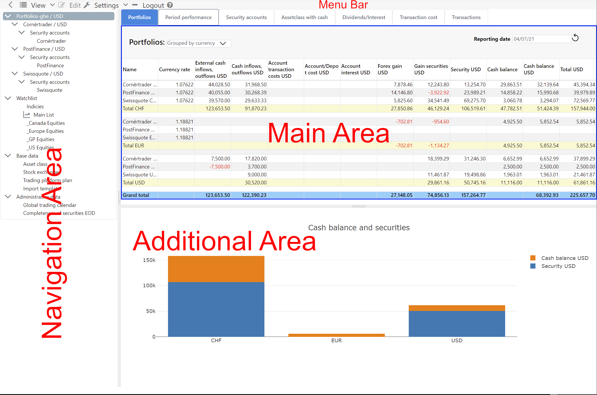

## User Interface
The application takes place in a web browser, therefore GT is a **client-serve application**. Usually, this is referred to as a **client-server application**, which includes a **front-end** and a **server** as **back-end**. The **client** is a **single page web application** that consists of a single HTML document after **login**. Individual page sections are dynamically refreshed or replaced. The **server** becomes a pure data provider for the client after the first pages of GT have been called. The user-friendly preparation of the data is done by the web browser.

### Subdivision user interface
Besides the **Menu bar**, the user interface is divided into three parts, the **Navigation Area**, **Main Area** and the **Additional Area**. By moving the **Divider** between these areas, you can adjust the size of the areas according to your needs. If the current **content** implements a **command**, this area can be activated. The activation is represented by a **blue frame**. This activation will adjust the **View** and **Edit** menus according to the active content. The **menu items** of the **Edit** submenu are also available in the **context menu**, so frequently used commands can be reached more quickly. In a **desktop web browser** the context menu appears with the **mouse right click**.

#### Menu bar
The **Setting** and **Logout** and **Help** menu items are static.
{}
**Why the right mouse button?**\
A large number of commands can be applied to certain entity. The implementation with buttons would take a lot of space.

{}

#### Navigation Area 
The **Navigation Area** contains the **Navigation tree**, via which the content of the **Main Area** is controlled. The **navigation** is hierarchically structured and has a mixture of **static elements** such as "Watchlist" and **dynamic elements** which are derived from your data.

#### Main Area with data
The **Main Area** reflects the content of the selected element in the **Navigation tree**. This area displays the data in tables or other structures. Often, the main area is divided into **tabs**. Clicking the corresponding **tab** brings another tab to the foreground.

#### Additional Area with graphics and data
The **Additional Area** is located below the main area. Its content is largely controlled by the interactions in the **Main Area**, for example, by displaying a graphic about the data in the **Main Area**.

{}
**Why these three areas?**\
New functionality can be easily integrated into these three areas. The navigation area can grow in depth and width. The main area can be supplemented with tabs and in the additional area various things can be mapped.
{}

### Dialog
The collection of data by the user takes place exclusively via **modal dialogs**. A model dialog opens in the foreground and reduces user interaction to this dialog. The visibility of a modal dialog is indicated by a **lightbox**, with the web page darkening in the background. The modal dialog allows **entities** like transactions to be captured without violating the concept of a **single page web application**, i.e. the current page is not left.

Editing an **entity** in a dialog is designed to be very interactive. The user's input changes the visibility of the **input elements**, i.e. input fields become visible or invisible others in turn change their interactivity.